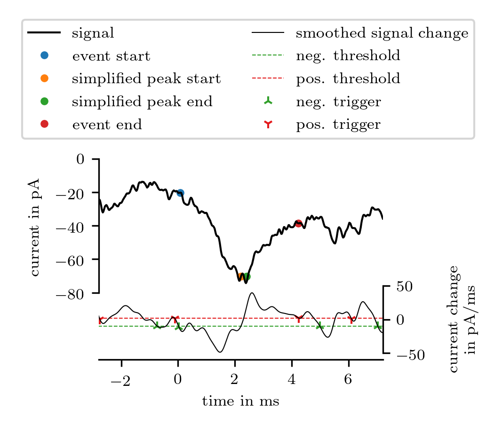
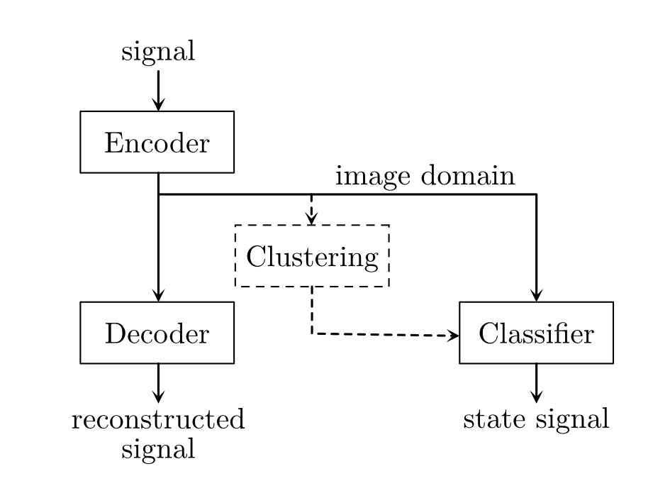

# Open Synaptic Event Analyzer for Python

  

**openSEApy** is a python package for the detection of spontaneous events in time series of patchclamp signals.

## Installation
Currently, the package is only available on github. To run the **openSEApy** package, the [**eventsearch**](https://github.com/digusil/eventsearch) is required.
```shell
git clone https://github.com/digusil/eventsearch
cd eventsearch && python setup.py install
```

If the eventsearch source is cloned into the snaa source, the testing will fail, because the imports in the 'eventesearch/tests/' will not be resolved properly. To prevent this use separate source folders or delete the 'eventesearch/tests/' folder. 

Recommended folder structure:

    .                   # source folder
    ├── ...
    ├── eventsearch     # eventsearch code
    │   ├── ...
    │   └── tests
    └── openseapy       # openSEApy code
        ├── ... 
        └── tests
        
After installing the **eventsearch** package, you can install the **openSEApy** package. 
```shell
git clone https://github.com/digusil/snaa
cd snaa && python setup.py install
```

### Testing
The package has an unittest for the core functions. Run the test in the 'openseapy/' or 'openseapy/tests/' folder.
```shell
python -m unittest
```
Alternative:
```shell
pytest
```

## Using
The data has to be converted to a SingleSignal object to be analyzed. This can be done manually by creating a blank 
SingleSignal object and adding the time and signal data or be loading a single or a group of Heka-mat- or generic 
csv-files. 

#### manually

```python
from openseapy.loader import CSVLoader
from openseapy.signals import SingleSignal


series = next(CSVLoader(time_row=0)('a_file.csv'))
t = series.index
y = series.values

signal = SingleSignal(t, y, name='test_data')
```

After loading the arrays for time `t` and signal values `y`, the arrays will be given to the SingleSignal initializer. 
In this case, the data will be loaded by the library own loader class for CSV files. It is possible to use alternative 
methods corresponding to your data and needs.  The parameter name is optional. You can set a custom name. The signal 
will be registered in the global __signal_names__ variable. If you try to register an additional signal with the same
name, the program rises a NameError to prevent multiple or misleading signals. If this is not necessary, the 
registration of the signal can be deactivated with the parameter `listed=False`.

#### Loader classes

```python
from openseapy.loader import CSVLoader, collect_data


loader = CSVLoader(amplify=1e15, time_row=0, sample_rate=50e3)

sources_dict = {
    'data/file_1.csv': {
        'type': 'cortex cell',
        'comment': ''
    },
    'data/file_2.csv': {
        'type': 'cortex cell',
        'comment': ''
    },
    'data/file_3.csv': {
        'type': 'horizontal cell',
        'comment': 'different cell!'
    },
}

dataset = collect_data(loader, sources_dict, 'data/collected_data.h5')
```

First, the loader function will be created. In this case, the signal values will be amplified by 1e15 instead of the
default 1e12. The time vector will be proofed with both parameter `time_row=0` and `sample_rate=50e3` set. If the sample
rate of the time vector differs from the given value, a AssertionError will be risen. The `sorces_dict` dictionary
defines the location of the data as keys and additional parameter, which will be stored in the dataframe, as values. 

By calling `collect_data(loader, sources_dict, 'data/collected_data.h5')` the function iterates over the dictionary and
extract, register the traces and store the traces in the hdf file *data/collected_data.h5*. Additionally, the function 
returns a SNADataset object containing of the loaded data. 

### Dataset class
The SNADataset class can be used to handle and preprocess the data. An additional benefit is the reduction of needed
RAM, because the signal data will be loaded dynamically form the hdf file. The SNADataset object reacts like a 
dictionary. To access a signal use square brackets and the trace name like it is stored in the `trace_df` dataframe.

For machine learning an extended version of the SNADataset exist in *ml/generators.py*. This version can generate a 
tfdata instance that can directly be used for training and validation.

### Analyzing

````python
from openseapy.events import EventDataFrame


event_df = EventDataFrame()
event_df.add_signal(signal)

event_df.search(neg_threshold=-7e3, pos_threshold=2e3, min_peak_threshold=5)
event_df.save('data/events.h5')
````

First, an EventDataFrame object have to be created. To analyze signals, the signals have to be added to the 
EventDataFrame object. Alternatively, it is possible to set a complete SNADataset as source for analysing with 
the `set_dataset` method. By calling the `search` method, the added signals will be analyzed with the *slope* algorithm.
The event dataframe can be accessed via die attribute `data`. EventDataFrame objects can be saved. The resulting hdf 
file contains the dataframe with the event data and the signals. Thus, the saved file contains all needed information. 

The *slope* algorithm generates several event values. *_time* marks a relative time position related to the 
*reference_time* value and *_value* marks a relative signal value related to the *reference_value*. Thus, all values are
directly comparable. The calculated values are:

- **zero_grad_start**: previous 0 gradient before the event start
- **start**: start of the event (linearized)
- **peak**: peak of the event
- **end**: end of the event
- **zero_grad_end**: first 0 gradient after the end of the event
- **slope**: maximum slope of the step
- **half_rising**: 50% of the step
- **rising_20**: 20% of the step
- **rising_80**: 80% ot the step
- **simplified_peak_start**: start of the peak for the linearized event shape
- **simplified_peak_end**: end of the peak for the linearized event shape
- **rising_time**: duration of the step
- **recovery_time**: duration of the recovery
- **integral**: area of the event
- **phase_counter**: number of positive inflection points during the step
- **previous_event_time_period**: period between the end of the previous and start of the current event
- **previous_event_reference_period**: period of the reference points to the previous event
- **intersection_problem**: the current event starts before the previous event ends
- **overlapping**: the current peak exists before the previous event ends
- **event_complex**: the current event has intersecting events before or after
- **pre_peak**: local maximum before the peak
- **fitted_camp_ymax**: settle value of the fitted exponential function
- **fitted_camp_tau**: time constant of the fitted exponential function
- **fitted_camp_loss**: loss of the fit
- **fitted_camp_status**: status of the fit corresponding to [scipy minimize result](https://docs.scipy.org/doc/scipy/reference/generated/scipy.optimize.OptimizeResult.html#scipy.optimize.OptimizeResult)

The fit of the exponential function can be deactivated by `search(extend=False)`. This reduces the calculation time.

### *slope* algorithm


The plot shows an exemplary signal and the analysis with the *slope* algorithm. The deviation of an unfiltered signal 
enhanced higher frequencies. Thus, the deviations become high dynamical. To prevent this, the signal will be filtered. 
The lower plot shows the deviation of the filtered signal. The original signal is shown in the upper plot. The lower
plot shows the negative and positive trigger points that will be used to determine the start and end of an event. Based
on the start and end point approximations the program calculates the other values based on linearisations and further
analyses. 

The following table shows the calculated parameter of the event of the figure.

| Parameter | Value |
| :---: | ---: |
| reference_time                           |     0.094789 |
| reference_value                          |   -20.567857 |
| start_time                               |     0.000071 |
| end_time                                 |     0.004231 |
| start_value                              |     0.274873 |
| end_value                                |   -18.020033 |
| peak_time                                |     0.002391 |
| peak_value                               |   -53.798121 |
| phase_counter                            |          4.0 |
| signal_name                              |         test |
| zero_grad_start_time                     |    -0.000069 |
| zero_grad_start_value                    |     1.211473 |
| zero_grad_end_time                       |     0.004831 |
| zero_grad_end_value                      |   -15.210235 |
| slope                                    | -49055.63148 |
| half_rising_value                        |   -26.293324 |
| half_rising_time                         |     0.001424 |
| rising_20_value                          |    -9.790446 |
| rising_20_time                           |     0.000691 |
| rising_80_value                          |   -42.796203 |
| rising_80_time                           |     0.001733 |
| simplified_peak_start_value              |   -49.835413 |
| simplified_peak_start_time               |     0.002214 |
| simplified_peak_end_value                |   -49.835413 |
| simplified_peak_end_time                 |     0.002411 |
| simplified_peak_duration                 |     0.000197 |
| rising_time                              |     0.002142 |
| recovery_time                            |      0.00182 |
| previous_event_time_gap                  |     0.002749 |
| previous_event_reference_period          |     0.004436 |
| intersection_problem                     |        False |
| overlapping                              |        False |
| event_complex                            |        False |
| previous_event_integral                  |    -0.006017 |
| previous_event_integral_difference       |    -0.114687 |
| pre_peak_time                            |    -0.000069 |
| pre_peak_value                           |     1.211473 |
| fitted_cap_ymax                          |   -13.577154 |
| fitted_cap_tau                           |     0.000874 |
| fitted_cap_loss                          |     2.375363 |
| fitted_cap_status                        |          0.0 |
| integral                                 |    -0.221727 |

## *Autoclassifier*


The *Autoclassifier* is an extension of the autoencoder principle. Instead of decoding the data back to the time domain, 
the *Autoclassifier* classifies the latent domain of the encoder. Equal to an autoencoder, the *Autoclassifier* has to 
be build from two models. I recommend to train your own models, but a set of sample models is nested in the ml 
subpackage. Further information 
- how the *Autoclassifier* have to be trained and 
- how the *Autoclassicier* works

can be found in the preprint on [bioRxiv.org](https://www.biorxiv.org/content/10.1101/2021.11.09.467896v1). A reviewed 
version will be published soon.

The following code shows how the *Autoclassifier* can be used:
```python
import os
import numpy as np

import tensorflow as tf
from tensorflow.keras.models import Model, load_model

from openseapy.ml.generator import SNADataset
from openseapy.ml.autoclassifier_tools import analyse_autoclassifier


# building utilities 
coding_length = 128

class AutoClassifier(Model):
    def __init__(self, encoder, classifier):
        super(AutoClassifier, self).__init__()

        self.encoder = encoder
        self.classifier = classifier

        assert self.encoder._distribution_strategy is self.classifier._distribution_strategy
        self._distribution_strategy = self.encoder._distribution_strategy

        assert self.encoder._run_eagerly is self.classifier._run_eagerly
        self._run_eagerly = self.encoder._run_eagerly

    def call(self, x):
        encoded = self.encoder(x)
        classified = self.classifier(encoded)

        return classified

    def save(self, base_name, *args, **kwargs):
        filename, file_extension = os.path.splitext(base_name)
        encoder_file = filename + '_encoder' + file_extension
        classifier_file = filename + '_classifier' + file_extension

        self.encoder.save(encoder_file, *args, **kwargs)
        self.classifier.save(classifier_file, *args, **kwargs)

    @classmethod
    def load(cls, encoder_path, classifier_path, *args, **kwargs):
        encoder = load_model(encoder_path, *args, **kwargs)
        classifier = load_model(classifier_path, *args, **kwargs)           

        return cls(encoder=encoder, classifier=classifier)

# load models and data 
autoclassifier = AutoClassifier.load(
    encoder_path='./ml/models/model_{}_encoder.h5'.format(coding_length), 
    classifier_path='./ml/models/model_{}_classifier.h5'.format(coding_length))

data = SNADataset.build(
    'data/collected_data.h5', 
    feature_length=coding_length, 
    target_length=coding_length
)

# build tfdata 
tfdata = tf.data.Dataset.from_generator(
    lambda: data.sequence_generator(),
    output_types=(tf.float32, tf.float32),
    output_shapes=((coding_length, 1),(coding_length, 1))
).cache()

# calculating the state signal and detecting the events
ac_data = np.argmax(autoclassifier.predict(tfdata.batch(1)), axis=1)

tmp_nans = np.empty(64)
tmp_nans.fill(np.NaN)

autoclassifier_data = np.concatenate((tmp_nans, ac_data, tmp_nans))

ac_events, ac_event_numbers = analyse_autoclassifier(autoclassifier_data)
```

The event parameter can be calculated by the *EventDataFrame* class. But instead of searching with an algorithm, the 
*ac_event_numbers* is an event mask and can be analysed by `event_df.check_event_mask(ac_event_numbers)`.

## Acknowledgement
This software was developed on the [institute for process machinery](https://www.ipat.tf.fau.eu) in cooperation with the [institute for animal physiology](https://www.tierphys.nat.fau.de).

## License
[Apache License 2.0](LICENSE.txt)
